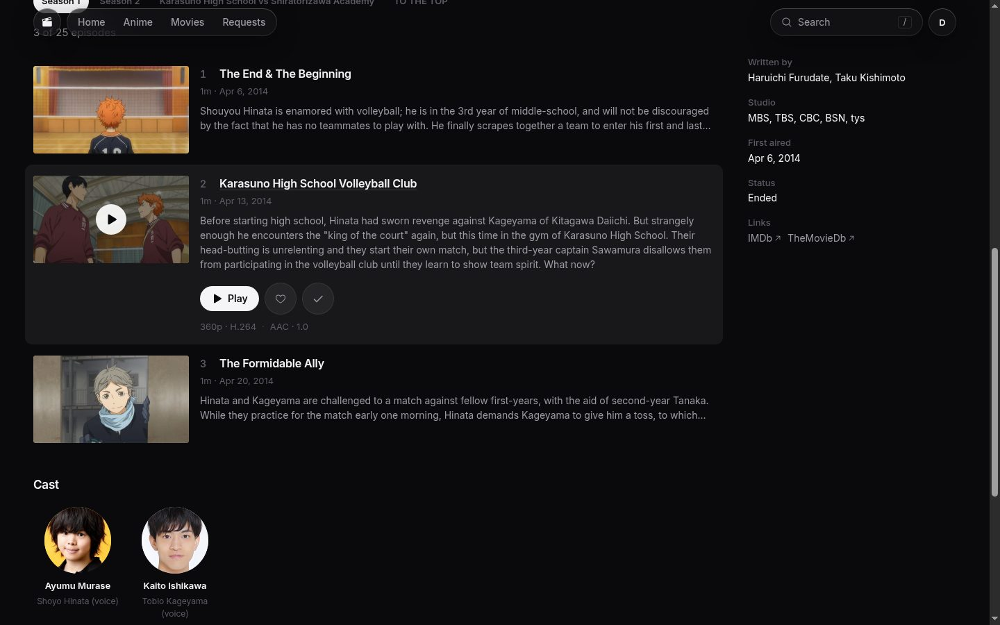
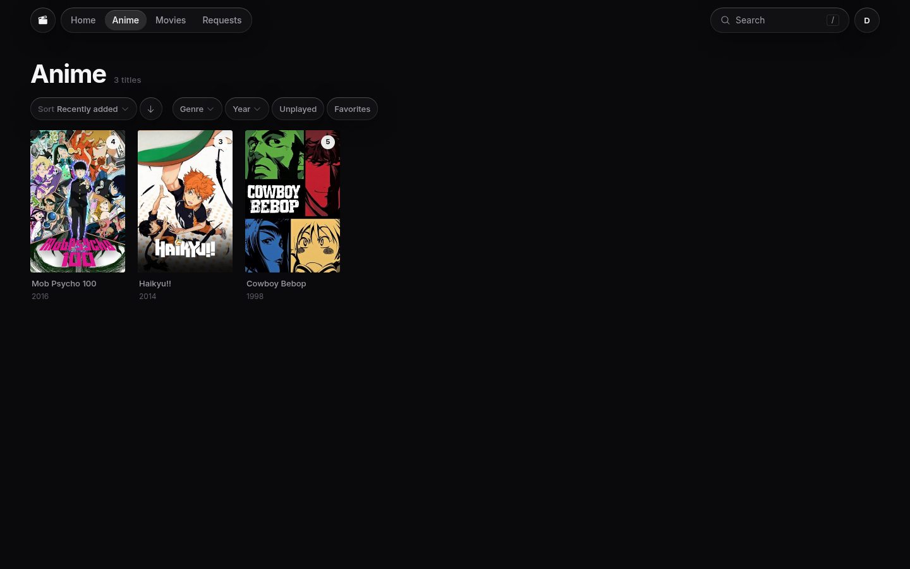
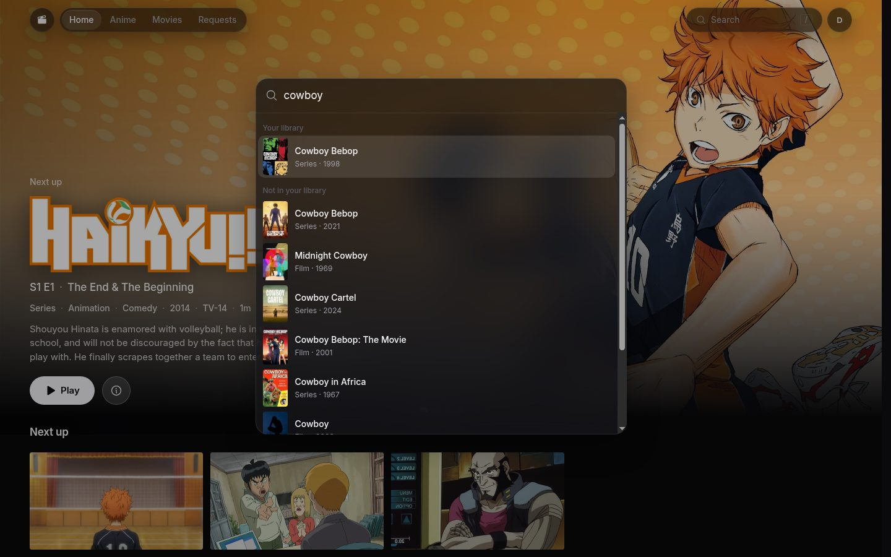

# jellyfin-client

A web client for [Jellyfin](https://jellyfin.org) with its own look: a cinematic home page,
one page per title with seasons and episodes inline, a `/` search palette, a custom player, and
optional [Seerr](https://github.com/seerr-team/seerr) integration for requesting what the library
is missing and watching it download.


<table>
  <tr>
    <td></td>
    <td></td>
  </tr>
  <tr>
    <td></td>
    <td></td>
  </tr>
</table>

## Stack

- React 19 + TypeScript, Vite SPA
- TanStack Router (file-based routes) + TanStack Query (IndexedDB-persisted cache)
- StyleX + React Aria Components, Motion
- Typed API client generated from the Jellyfin OpenAPI spec with `@hey-api/openapi-ts`
- oxlint + oxfmt, Vitest

## Develop

```sh
npm install
npm run dev
```

Two optional build-time variables tailor a build to one setup (set them in the shell, a `.env.local`,
or as Docker `--build-arg`s); leave both unset for a generic build:

- `VITE_JELLYFIN_URL=https://jellyfin.example.com` — the server this build signs into, so the login
  page skips the address step. Otherwise the server is entered at runtime.
- `VITE_BRAND_MARK=🍵` — an emoji or short glyph used as the header mark and favicon. Otherwise a
  neutral icon is used.

Seerr is reached through the app's own origin at `/seerr`; point the dev proxy at an instance with
`SEERR_URL=https://seerr.example.com npm run dev` (or a `.env.local`).

### Throwaway Jellyfin + Seerr

`dev/seed.sh` brings up both in Docker (needs `docker compose`, `ffmpeg`, `jq`), generates a small
library of test-pattern clips filed under real titles so metadata and artwork resolve, and completes
both setup wizards. Re-running it is a no-op for everything already done; data lives in `dev/data`.

```sh
./dev/seed.sh
SEERR_URL=http://localhost:5055 npm run dev
```

Sign in with server `http://localhost:8096`, user `devin`, password `devin`. Haikyu!! and Mob Psycho
100 are deliberately incomplete so the request flows have something to do.

## Regenerate the API client

`api/openapi.json` is a pinned copy of the server's `/api-docs/openapi.json` with the `servers` entry removed.

```sh
curl -s "$JELLYFIN_URL/api-docs/openapi.json" | jq 'del(.servers)' > api/openapi.json
npm run generate
```

## Scripts

| Command             | Purpose                      |
| ------------------- | ---------------------------- |
| `npm run dev`       | Vite dev server              |
| `npm run build`     | Typecheck + production build |
| `npm run typecheck` | `tsc`                        |
| `npm run lint`      | oxlint                       |
| `npm run fmt`       | oxfmt (write)                |
| `npm run fmt:check` | oxfmt (check)                |
| `npm run test`      | Vitest                       |
| `npm run generate`  | Regenerate `src/api/gen`     |

## Docker

```sh
docker build -t jellyfin-client .
docker run -p 8080:80 jellyfin-client
```

Serves the static build with nginx; the Jellyfin server URL is entered at sign-in.

## Nix

`nix build` puts the `dist/` tree in `result`. Consumers get the same package from the flake and set
the two build-time variables through its arguments:

```nix
inputs.jellyfin-client.url = "github:oliver-ni/jellyfin-client";

jellyfin-client.packages.${system}.default.override {
  jellyfinUrl = "https://jellyfin.example.com";
  brandMark = "🍵";
}
```

`package-lock.hash` pins the npm dependencies for the sandboxed build; regenerate it in the same
commit as any `package-lock.json` change:

```sh
prefetch-npm-deps package-lock.json > package-lock.hash
```

`nix develop` gives a shell with Node and `prefetch-npm-deps`.
